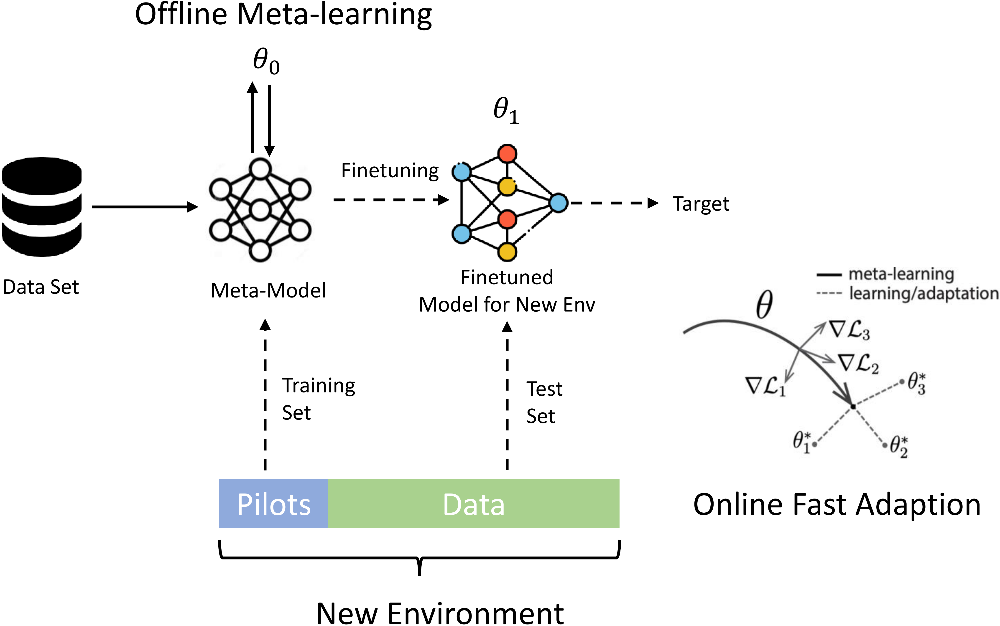

# Neuromorphic-Semantic-Communication-for-Future-Wireless-Systems
This repository contains the source code and documentation for my MSc project, submitted in partial fulfillment of the requirements for the degree of MSc in Communications and Signal Processing at Imperial College London.

### [Thesis](./Haoxiang_Huang_MSc_Thesis.pdf) | [Author](https://haoxiang01.github.io/) 
## Installation
Please follow the instructions below to install the repo and dependencies.

```bash
https://github.com/haoxiang01/Neuromorphic-Semantic-Communication-for-Future-Wireless-Systems.git
cd Att-NeuroSC
```

### Install the environment
- Python
- Pytorch 
- Spikingjelly

## Citation

If you find this project  is helpful to your research, please consider cite:
```
@MastersThesis{huang2024msc,
    author     =     {Huang, Haoxiang},
    title     =     {Neuromorphic-Semantic-Communication-for-Future-Wireless-Systems},
    school     =     {Imperial College London},
    year     =     {2024},
    month     =     {September}
}
```

## Future Work
If you find this future direction interesting, please feel free to email me to discuss it further.
### Distributed Sensing Scenario

This example describes a distributed sensors system with two sensors (K=2). Each sensor device captures a fraction (μ) of the speech signal from the source. In this example, μ is less than 0.5, meaning that the two devices combined cannot fully capture the entire speech signal.

<p align="center"> 
  <a href="">
    
  </a>
</p>

### Fast Changing Communications Scenario
-  **Meta-learning** algorithm for fast adaptation to new environments with few-shot pilots:

- **New Environment:**
  - SNR
  - PDP

<p align="center"> 
  <a href="">
    
  </a>
</p>


